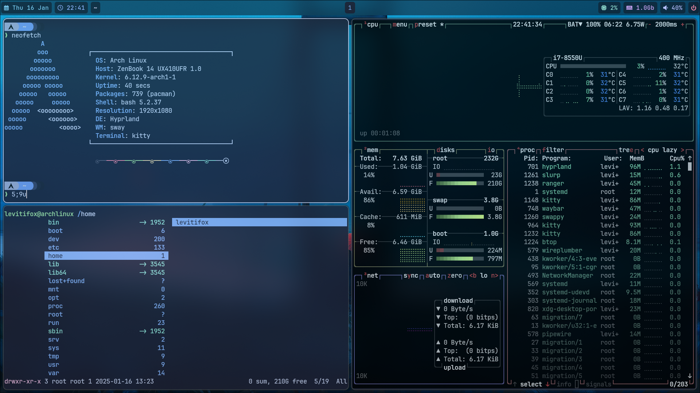

# Arch Linux Hyprland Dotfiles

Configuration files and scripts for setting up a streamlined Arch Linux environment with Hyprland as the Wayland compositor. This repository is designed to provide a straightforward setup and maintain a consistent workflow for daily use.

## Features
- Optimized for Hyprland, a dynamic tiling Wayland compositor.
- Includes configurations for essential applications and tools.
- Automates setup with scripts to minimize manual intervention.
- Organized structure for easy navigation and customization.

## Use Case
Ideal for users who want a pre-configured, minimal, and efficient system setup with Hyprland on Arch Linux. The configurations emphasize usability, aesthetics, and performance.



---

## Installation

### Recommendations (Using `archinstall`)
- **Disk Format**: ext4  
- **Bootloader**: GRUB  
- **Audio**: PipeWire  

#### Additional Packages:
- `git`, `nano`  

#### Network Configuration:
- **Network Manager**  

---

### First Run Setup
1. Clone and install the `yay` AUR helper:
    ```bash
    cd /opt/
    sudo git clone https://aur.archlinux.org/yay-git.git
    sudo chown -R <username>:<username> yay-git/
    cd yay-git/
    makepkg -si
    ```

2. Update your system:
    ```bash
    yay -Suy
    ```

3. Clone this repository and set up Hyprland:
    ```bash
    cd /opt/
    sudo git clone https://github.com/Levitifox/hyprstack.git
    sudo chown -R <username>:<username> hyprstack/
    cd hyprstack/
    chmod +x set-hypr
    ./set-hypr
    ```

## Useful Commands and Configurations

### Set Up Auto-login

1. Create the necessary directory:
   ```bash
   sudo mkdir -p /etc/systemd/system/getty@tty1.service.d/
   ```

2. Edit the override configuration file:
   ```bash
   sudo nano /etc/systemd/system/getty@tty1.service.d/override.conf
   ```

3. Add the following content to the file:
   ```ini
   [Service]
   ExecStart=
   ExecStart=-/sbin/agetty --autologin <username> --noclear %I $TERM
   ```

### Remove Password Prompt for `sudo` Commands

1. Open the sudoers file for editing:
   ```bash
   sudo visudo
   ```

2. Add the following line at the end of the file:
   ```plaintext
   <username> ALL=(ALL) NOPASSWD: ALL
   ```

---

## Applications

| **Application**          | **Description**                                  |
|---------------------------|-------------------------------------------------|
| `hyprland`               | A dynamic tiling Wayland compositor.            |
| `kitty`                  | Terminal emulator.                              |
| `waybar`                 | Customizable status bar for Wayland.            |
| `swaybg`                 | Wallpaper utility for Wayland.                  |
| `swaylock-effects`       | Screen locker with effects.                     |
| `wofi`                   | Wayland-native launcher.                        |
| `wlogout`                | Logout menu for Wayland.                        |
| `polkit-gnome`           | Polkit authentication agent.                    |
| `python-requests`        | Python HTTP library.                            |
| `starship`               | Cross-shell prompt.                             |
| `swappy`                 | Screenshot editing tool.                        |
| `grim`, `slurp`          | Screenshot tools for Wayland.                   |
| `pamixer`                | CLI mixer for PulseAudio/ALSA.                  |
| `brightnessctl`          | Screen brightness control utility.              |
| `gvfs`                   | Virtual filesystem.                             |
| `bluez`, `bluez-utils`   | Bluetooth protocol stack and utilities.         |
| `lxappearance`           | GTK+ theme switcher.                            |
| `xfce4-settings`         | XFCE settings manager.                          |
| `dracula-gtk-theme`      | Dracula GTK theme.                              |
| `dracula-icons-git`      | Dracula icons.                                  |
| `xdg-desktop-portal-hyprland` | Desktop integration for Hyprland.        |
| `code`                   | Visual Studio Code editor.                      |
| `kde-frameworks`         | KDE libraries and tools.                        |
| `kdelibs`                | KDE legacy libraries.                           |
| `kde-gtk-config`         | GTK theme configuration for KDE.                |
| `arc-gtk-theme`          | GTK theme.                                      |
| `thunar`                 | XFCE file manager.                              |
| `xorg-setxkbmap`         | Keyboard layout utility.                        |
| `swaync`                 | Notification center for Wayland.                |
| `jq`                     | JSON processor.                                 |
| `hyprctl`, `hyprlock`    | Hyprland utilities.                             |
| `btop`, `htop`           | Resource monitors.                              |
| `neofetch`               | System information tool.                        |
| `clipman`                | Clipboard manager.                              |
| `zathura`               | Lightweight document viewer.                    |
| `gnome-calculator`      | Calculator application.                         |
| `gnome-calendar`        | Calendar application.                           |
| `blueman`               | Bluetooth manager.                              |
| `telegram-desktop`      | Telegram messaging client.                      |
| `discord`               | Voice, video, and text communication platform.  |
| `skypeforlinux-stable-bin` | Skype messaging and video calling client.     |
| `youtube-music-bin`     | YouTube Music desktop app.                      |
| `obsidian`              | Note-taking and knowledge management app.       |
| `obs-studio`            | Open-source screen recorder and streaming tool. |
| `gimp`                  | GNU Image Manipulation Program.                 |

---

## Aliases

| **Alias**              | **Description**                                     |
|------------------------|-----------------------------------------------------|
| `update-system`        | Update system using `pacman` and `yay`               |
| `update`               | Update system with `pacman -Syu`                    |
| `fullupdate`           | Full system update with `pacman -Syyu`              |
| `ls`                   | List directory contents using `exa`                 |
| `ll`                   | List directory contents in long format using `exa`  |
| `la`                   | List all files, including hidden, using `exa`       |
| `ram`                  | Display memory usage with `free -h`                 |
| `cpu`                  | Display CPU information with `lscpu`                |
| `disk`                 | Display disk usage with `df -h`                     |
| `search`               | Search for packages with `pacman -Ss`               |
| `install`              | Install packages with `sudo pacman -S`              |
| `remove`               | Remove packages with `sudo pacman -Rns`             |
| `info`                 | Display package information with `pacman -Si`       |
| `orphan`               | Find orphaned packages with `pacman -Qtdq`          |
| `cleanup`              | Remove orphaned packages with `pacman -Rns $(pacman -Qtdq)` |
| `list`                 | List manually installed packages with `pacman -Qe`  |
| `yay-update`           | Update AUR and repositories with `yay -Syu --devel --timeupdate` |
| `yay-clean`            | Remove orphaned packages from AUR with `yay -Rns $(yay -Qtdq)` |
| `yay-search`           | Search for AUR packages with `yay -Ss`              |
| `yay-install`          | Install AUR packages with `yay -S`                  |
| `yay-remove`           | Remove AUR packages with `yay -Rns`                 |

---

## Keybindings

### General
- `SUPER + Q`: Close focused window  
- `SUPER + Del`: Exit Hyprland session  
- `SUPER + T`: Launch terminal (kitty)  
- `SUPER + E`: Launch file manager (thunar)  
- `SUPER + C`: Launch text editor (VS Code)  
- `SUPER + B`: Launch browser (Google Chrome)  
- `SUPER + R`: Launch app launcher (wofi)  
- `SUPER + P`: Partial screenshot  
- `SUPER + L`: Lock screen
- `SUPER + V`: Open clipboard manager (clipman)

### Focus Management
- `SUPER + Left/Right/Up/Down`: Move focus  
- `ALT + Tab`: Move focus down  

### Workspace Switching
- `SUPER + 1-9, 0`: Switch to workspace 1-10  
- `SUPER + CTRL + Right/Left`: Switch to next/previous workspace  
- `SUPER + CTRL + Down`: Move to first empty workspace  

### Resizing Windows
- `SUPER + SHIFT + Arrow Keys`: Resize window  

### Move Windows to Workspaces
- `SUPER + SHIFT + 1-9, 0`: Move window to workspace  
- `SUPER + CTRL + ALT + Right/Left`: Move window to next/previous workspace  

### Window Movement
- `SUPER + SHIFT + CTRL + Arrow Keys`: Move window  

### Workspace Scrolling
- `SUPER + Mouse Scroll`: Scroll through workspaces  

### Move/Resize Windows with Mouse
- `SUPER + Left Mouse Button`: Move window  
- `SUPER + Right Mouse Button`: Resize window  

### Silent Workspace Movement
- `SUPER + ALT + 1-9, 0`: Silently move window to workspace  